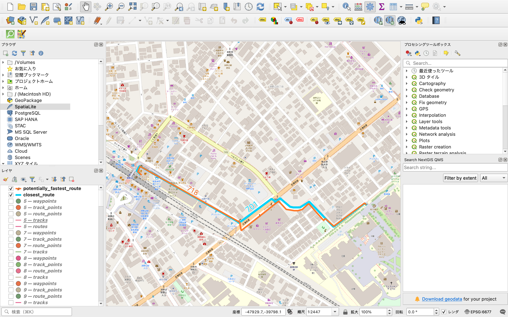

# 2025gsc-AkiraMotoyoshi

# 登下校ルート分析（淵野辺駅北口 → 青山学院大学相模原キャンパス）
## School Commuting Route Analysis  
### (Fuchinobe Station North Exit → Aoyama Gakuin Univ. Sagamihara Campus)

---

## 📂 **Power Point（発表スライド）**

[こちらのリンクから閲覧できます](https://aoyamajp-my.sharepoint.com/:p:/g/personal/aa123191_aoyama_jp/ESa7l4GgSRtOpCJfYLqhQcQBFu6b1HZE5cE1NhNoImUE-A?e=4aRIaA)

---

## 1. 研究概要 / Research Overview

### 🇯🇵 日本語
本研究は、実際の学生が通学で使用する「淵野辺駅北口 → 青山学院大学相模原キャンパス」のルートを対象に、  
**最短距離・歩きやすさ・夜の安全性（街灯密度）** の3点から比較・分析を行う。  
必要に応じて **Google Earth / QGIS / OpenStreetMap / Strava** を使用し、データ取得・可視化・分析を行う。

### 🌐 English
This study analyzes the commuting route from *Fuchinobe Station (North Exit)* to *Aoyama Gakuin University Sagamihara Campus*.  
The evaluation focuses on **distance, walkability (obstacles), and nighttime safety (streetlight density)**.  
Data collection and visualization are performed using **Google Earth, QGIS, OpenStreetMap, and Strava**.

---

## 2. 研究目的 / Objectives

### 🇯🇵 日本語
- 通学ルートの **距離・安全性・歩きやすさ** を定量的に比較  
- 学生がルートを選ぶ理由を把握する  
- QGIS で地図として可視化し、レポートとしてまとめる  

### 🌐 English
- Quantitatively compare **distance, safety, and walkability** of commuting routes  
- Understand why students choose specific routes  
- Visualize maps in QGIS and summarize findings in a final report  

---

## 🛠 3. 使用ツール / Tools

### 🇯🇵 日本語
- **QGIS**：距離計測、街灯密度分析、地図作成  
- **OpenStreetMap (OSM)**：道路・信号・横断歩道・街灯データ  
- **Google Earth**：景観確認、歩道状況のチェック  
- **Strava（無料版）**：歩行ログ（GPX）取得、移動速度・停止時間の分析  
- **ChatGPT**：研究設計、手順の作成、分析補助、コーディング補助  

### 🌐 English
- **QGIS:** distance measurement, streetlight density analysis, map creation  
- **OpenStreetMap:** road network, signals, crosswalks, streetlight data  
- **Google Earth:** visual confirmation of sidewalks and surroundings  
- **Strava (Free):** walking logs (GPX), speed, and stopping time analysis  
- **ChatGPT:** research planning support, analytical assistance, workflow design, coding support  

---

## 4. 研究フロー / Research Workflow

---

## 研究方法 / Methodology

本研究では、「淵野辺駅北口 → 青山学院大学相模原キャンパス正門」の登下校ルートを対象に、  
**距離・実測歩行時間・信号待ち時間・横断要素**を考慮した最速ルートの導出を行った。  
以下に、データ収集から分析までの手順を示す。

---

### 1. 歩行ルートの選定と絞り込み

すべての道路を実際に歩いて計測することは、  
**データ収集量・時間・組み合わせ数の観点から非現実的**である。

そのため、以下の基準で候補ルートを絞り込んだ。

- 明らかに遠回りとなるルートは除外
- 距離や構造がほぼ同一のルートは代表的なものに集約
- 実際に学生が利用していると考えられるルートを優先

絞り込んだ複数の候補ルートを **QGIS 上に LineString として作成**し、  
本研究の分析対象とした。

---

### 2. ルートのセクション分割

ルート全体をそのまま比較すると、  
組み合わせ数が非常に多くなり、分析が困難になる。

そこで、ルートを **セクション単位** に分割し、  
後からセクションを組み合わせて評価する手法を採用した。

**セクションの切れ目**
- 主要な交差点
- 信号のある地点

**全交差点で分割しなかった理由**
- セクションが短くなりすぎると、  
  GPS誤差や計測誤差の影響が相対的に大きくなるため

この結果、分析に用いるセクションは以下の構成となった。（※後ほど図を追加予定）

---

### 3. Strava を用いた実地歩行計測

Strava（無料版）の **Walk 機能**を用いて、  
淵野辺駅改札から大学正門までを実際に歩行し、GPX データを取得した。

**計測条件**
- 同一セクションは **最低5回以上** 歩行
- 時間帯や体調による偏りを避けるため、複数日に分けて実施

これにより、個人差や偶然による誤差を低減した。

---

### 4. GPX データの分割と整理

取得した GPX データは、  
**GPX Track Splitter** を用いてセクション単位に分割した。

- 1セクション = 1GPX
- 各セクションについて、時間・距離データを抽出

---

### 5. セクション別平均値の算出

すべてのセクションについて、

- 歩行時間
- 距離

を Excel に整理し、**平均値**を算出した。

平均値を用いた理由は、  
**母数の多いデータから平均を取ることで、偶発的な誤差を減らすため**である。

---

### 6. 最速ルートの構成（セクション合成）

セクションを以下の2段階に分けて整理した。

- **Level 1**：駅周辺〜中間地点
- **Level 2**：中間地点〜大学正門

各レベルで **最も平均歩行時間が短いセクション**を抽出し、  
それらを組み合わせることで、大学までの最速ルートを導出した。

---

### 7. 信号待ち時間の算定

歩行時間だけでなく、信号による待ち時間を考慮するため、  
以下の2交差点を対象に平均信号待ち時間を算定した。

- **Point B：淵野辺駅入口交差点**
- **Point C：青山学院大学入口交差点**

信号待ち時間は、  
**信号ローテーションに基づく期待値モデル**を用いて算出した。

\[
E(W) = \frac{T_{\text{red}}}{2}
\]

- Point B：58 秒  
- Point C：26.6 秒  

これらをルート所要時間に加算した。

---

### 8. 信号のない横断歩道の処理

信号のない横断歩道については、

- 車両確認
- 減速・一時停止

に要する時間は比較的短く、  
ばらつきも小さいと判断した。

そのため、本研究では  
**1回の横断につき平均10秒** と仮定し、  
横断回数に応じて所要時間に加算した。

---

### 9. 最終所要時間の決定

以下をすべて考慮した最終的な所要時間を算出した。

- セクション別平均歩行時間
- 信号待ち時間
- 信号のない横断歩道による遅延

これにより、  
**障害物を考慮した実質的な最速登下校ルート**を決定した。

---

### ⑨ 最終成果物 / Final Deliverables

#### 1. QGIS 可視化マップ  
- 距離マップ  
- Strava 重ね合わせ  
- 信号・横断歩道マップ  
- 街灯密度マップ  

---

## 📚 先行研究まとめ

### 1. 大友秀一（2008）
**タイトル**：小学校におけるGISの学校安全への応用に関する研究  
**概要（3文）**：  
GIS を用いて小学校の通学路における危険箇所を可視化した先駆的研究。危険地点の多くが細い路地や見通しの悪い場所に集中することを示した。通学路安全評価に GIS を取り入れる手法の基礎を築いた。  
**リンク**：https://hyogo-u.repo.nii.ac.jp/record/2494/files/geo1303.pdf

---

### 2. 王尾和寿（2014）
**タイトル**：通学路における不安箇所のマッピングとその空間的特徴  
**概要（3文）**：  
児童・保護者の感じた「不安地点」を GIS にマッピングし、ヒートマップを用いて空間分布を分析した研究。不安箇所は交差点や交通量の多い道路、見通しの悪い地点に集中する傾向が明らかになった。主観的不安と道路環境の関連を示した点が特徴である。  
**リンク**：https://cir.nii.ac.jp/crid/1390282680673368704

---

### 3. 吉城秀治（2017）
**タイトル**：通学路における小学生のアクティビティの発生傾向とその要因の検討  
**概要（3文）**：  
通学中の児童行動（立ち止まり・集団形成など）を現地観察し、GIS で道路環境との関連を分析した研究。交差点・信号待ち・歩道の狭い場所で行動が変化しやすいことが示された。道路構造が児童の安全行動に影響を与えることを明確にした。  
**リンク**：https://www.jstage.jst.go.jp/article/journalcpij/52/3/52_879/_article/-char/ja/

---

## 📁 ディレクトリ構成 / Directory Structure

